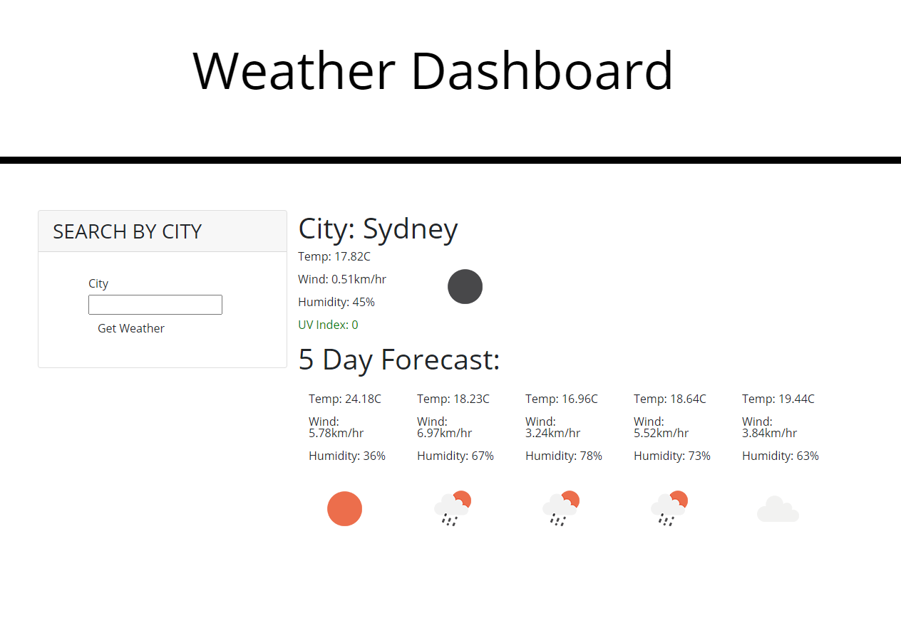

Weather Dashboard

[Link](https://jessluff.github.io/weather-dashboard/)

HTML | CSS | Javascript | OpenWeather API

This webpage allows a user to enter a city into the search bar, and the current weather and 5 day forecast will be shown. The icon updates based on the weather (current or forecast) and the UVI index colour changes based on the severity.

Future work for this webpage includes saving past searches as a list of buttons, such that they can be selected and that city's weather will be displayed again.

License: MIT

Creator: JessLuff
Email: jessica.luff@outlook.com
[Github](https://github.com/JessLuff)
